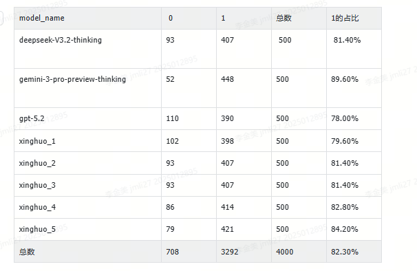
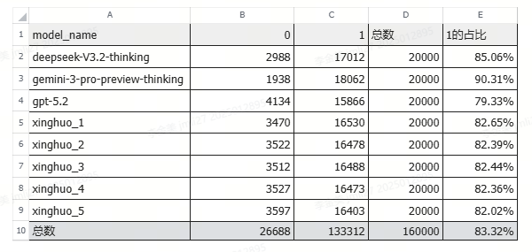

开放式问答总数:53,668条
中文题目:39,095条(72.85%)
英文题目:14,573条(27.15%)

验证集：
随机抽取 400 条中文数据 和 100 条英文数据
500query * 8 answer = 4,000 条 Q-A
交给 gemini-3-pro-preview-thinking 打分，打分结果如下：

训练集：
随机抽取 16,000条中文数据 和 4,000 条英文数据
20,000 query * 8 answer = 160,000 条 Q-A
交给 gemini-3-pro-preview-thinking 打分，打分结果如下：
