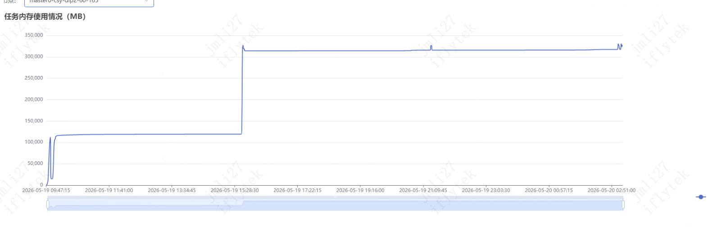

# RL vs SFT 训练资源波形差异分析

记录 Qwen3.5-27B GRPO RL 训练时观测到的 **GPU 利用率 / GPU 显存 / 任务内存** 三条监控曲线呈现"规律式波动"现象，并对比 SFT 训练时几乎是直线的原因。

相关截图：
- 
- 
- 
- 
- 
- 

---

## 一、核心结论先放最前面

**SFT 训练的循环结构只有 1 个 phase，所以三条曲线接近常数；RL 训练每个 step 由 5-6 个 phase 组成，每个 phase 的"用谁的显存、用 GPU 还是 CPU、跑谁的 kernel"都不一样，叠加 verl 的 `ALL_OFFLOAD` 策略后，资源就会随 step 节奏起伏成"心电图"形状。**

| 曲线 | SFT | RL |
|---|---|---|
| GPU 利用率 | ~95% 平直线 | **周期性波动**：100% → 0% → 100% 反复（每个 step 内多次峰谷）|
| GPU 显存 | 接近峰值平直线 | **方波**：rollout 时 vLLM 占满 → train 时 Megatron 占满，中间换手时降到很低 |
| 任务内存（CPU 侧）| 平直线 | **锯齿波**：训练时 optimizer 在 CPU → 内存高峰；rollout 时 CPU 闲 → 内存低谷 |
| 触发"凹槽"的事件 | 仅 `save_freq` 存 ckpt | 每个 step 都凹一次（rollout↔train 切换），每 `save_freq` 大凹一次 |

---

## 二、SFT 的训练循环：单一相位

SFT 的每一步只做一件事：

```
for batch in dataloader:
    logits = model(batch.input_ids)            # forward (GPU 满载)
    loss = cross_entropy(logits, batch.labels)
    loss.backward()                            # backward (GPU 满载)
    optimizer.step()                           # update (GPU 满载)
    optimizer.zero_grad()
    # 下一个 batch
```

**每一步的资源画像几乎相同**：
- GPU 利用率：>95%（只有 forward/backward/step 之间的 kernel 间隙短暂回落到 80%+）
- GPU 显存：**model + activations + gradients + optimizer state** 一直在 GPU 上，**几乎不变**
- CPU/任务内存：dataloader workers 持续读数据，**几乎不变**

→ **3 条监控曲线几乎是直线**。唯一例外是 `save_freq` 触发 ckpt 保存时：
- 主进程暂停训练
- 把模型/optimizer 序列化到磁盘
- 这段时间 GPU 闲 → **GPU 利用率出现一个深 V**
- GPU 显存不变（数据还在显存里）
- 任务内存可能临时上升（pickle 序列化时的中间副本）

这就是你 SFT 截图里"几乎平直 + 每隔一段时间一个深谷"的来源。

---

## 三、RL（GRPO）的训练循环：5 个相位轮转

RL 训练的每一个 step **不是"一次前向反向"那么简单**，而是一个**多阶段流水线**：

```
for step in range(total_steps):
    # === Phase 1: 拉一个 batch 的 prompt 给 vLLM ===
    batch = next(dataloader)

    # === Phase 2: Rollout（vLLM 推理）===
    # 把 actor 权重同步到 vLLM（如果上一步训过）
    # vLLM 用当前权重生成 n=8 条 response
    responses = vllm.generate(batch.prompts)

    # === Phase 3: 计算 reward ===
    # rule: 调 reward_fn(prompt, response) → 标量
    # genrm: 起 GRM vLLM，再走一遍推理打分
    rewards = reward_fn(batch.prompts, responses)

    # === Phase 4: log_prob 计算 ===
    # 用 ref 模型 + actor 模型分别对 (prompt+response) 做 forward
    # 拿到每个 token 的 log_prob，算 KL 和 advantage
    ref_logprobs = ref_model.forward(batch + responses)
    old_logprobs = actor_model.forward(batch + responses)

    # === Phase 5: Actor 训练（多个 PPO mini-batch epoch）===
    for mini_epoch in range(ppo_epochs):
        for mini_batch in chunks(batch, ppo_mini_batch_size):
            logits = actor_model.forward(mini_batch)
            loss = grpo_loss(logits, advantage, old_logprobs, ref_logprobs)
            loss.backward()
            optimizer.step()

    # === Phase 6: 把训完的权重再同步给 vLLM（下个 step 用）===
    sync_weights_to_vllm(actor_model)
```

**每个 phase 用的资源完全不同**，下面逐个拆。

---

## 四、每个 phase 的资源画像

### Phase 2 — Rollout（vLLM 推理）
| 资源 | 状态 |
|---|---|
| GPU 利用率 | **100% 满载**（vLLM 高吞吐 decode，所有 GPU 都在跑 attention）|
| GPU 显存 | **vLLM 模型 (TP=8 分片) + 巨大 KV cache (gpu_memory_utilization=0.6)** —— 接近峰值 |
| Megatron actor 在哪 | **被 offload 到 CPU**（因为开了 `ALL_OFFLOAD=True`）|
| 训练 optimizer | **在 CPU** |
| CPU/任务内存 | **高峰**：actor weights + optimizer state + grad buffer 全堆在 CPU |

→ rollout 阶段：**GPU 显存被 vLLM 占满、CPU 内存被训练状态占满**。

### Phase 4 — log_prob 计算（ref / actor forward）
| 资源 | 状态 |
|---|---|
| GPU 利用率 | **80-100%**（纯 forward，不需要 backward）|
| GPU 显存 | **从 vLLM 切回 Megatron**——这一切换非常"扎眼"|
| 切换过程 | 1. vLLM `sleep()` 把 KV cache 释放（不释放 weight，节省后续 wake 时间）2. Megatron actor weight **从 CPU swap 回 GPU** 3. 跑 forward |
| 切换时 GPU 显存 | **凹槽**：vLLM 释放 → Megatron 加载之间有几秒"空窗" |
| 切换时 GPU 利用率 | **凹槽**：从 100% 直接掉到接近 0% |
| 切换时 CPU 内存 | **下降**：actor weights 离开 CPU |

### Phase 5 — Actor 训练（最重的相位）
| 资源 | 状态 |
|---|---|
| GPU 利用率 | **100% 持续**（forward + backward + optimizer step）|
| GPU 显存 | **更高**：activations（recompute=full 已经省了一部分）+ gradients + 部分 optimizer state |
| optimizer state 位置 | 主体在 CPU（`optimizer_offload=True`），但每次 step 时要把对应分片传上 GPU 算 |
| CPU↔GPU 带宽 | **持续打满**（你设了 `overlap_cpu_optimizer_d2h_h2d=True` 减少阻塞）|
| CPU 内存 | **缓慢下降**：optimizer state 在 CPU 但被部分占用 |

### Phase 6 — Weight sync 回 vLLM
| 资源 | 状态 |
|---|---|
| 网络 | **NCCL allgather 打满**（27B BF16 ≈ 54GB，`update_weights_bucket_megabytes=4096` 切 14 桶）|
| GPU 利用率 | **回落到 ~30-50%**（不是计算密集）|
| GPU 显存 | **瞬时双倍**：旧 vLLM 权重还没释放、新权重已经在路上 |

---

## 五、为什么 RL 曲线呈"规律式波动"

把上面 5 个 phase 在时间轴上画出来（**一个 step 内**）：

```
GPU 利用率：
  Rollout    sleep/swap  log_prob   train      sync     ┐
   100% ─────╮    ╭───────  100% ─── 100% ─── 50% ──────│ 一个 step
              ╰────╯                                     │ 重复
                                                        │
GPU 显存：
   vLLM峰 ───╮    ╭ Megatron 峰 ──── 训练峰 ───────────┤
              ╰────╯                                    │
              低谷                                       │
                                                        │
任务内存：
   高 ────────╮              ╭──── 高 ──────────────────│
              ╰─────────────╯                          │
              （actor 回 GPU）                          │
                                                       ┘
```

**关键时刻**：
- **每个 step 开头**：actor 从 CPU 回 GPU（任务内存↓）+ vLLM 让位（GPU 显存先↓后↑）
- **每个 step 中段**：actor 训练（GPU 利用率持续 100%，显存升到峰值）
- **每个 step 结尾**：weight sync NCCL 风暴（GPU 利用率短暂回落）

→ 监控以秒级采样，**每个 step 内出现 2-3 次峰谷**，所以你看到的是"心电图"式的高频波动。

→ 把时间拉长（一小时维度），就形成"规律式的方波"，**周期 = 单 step 时间**（你 32 卡稳态约 17 min/step → 监控上一个完整波形约 17 min）。

### 进一步触发"大凹槽"的事件

| 事件 | 频率 | 波形表现 |
|---|---|---|
| 单 step 内 phase 切换 | 每 step 4-6 次 | 小幅波动 |
| `test_freq=10` 触发 val | 每 10 step 1 次 | val 没有训练阶段，只有 rollout + reward → **GPU 利用率"少一段"** |
| `save_freq=50` 保存 ckpt | 每 50 step 1 次 | GPU 完全 idle 几分钟 → **大深谷** |
| `val_before_train=True` 首次 val | 仅 step 0 | 第一个完整波形前的"前奏"，往往比普通 step 长很多 |

这些事件叠加在基础波形上，就形成你截图里"主旋律 + 偶发深谷"的复合曲线。

---

## 六、为什么 SFT 没有这些波动

SFT **缺失了 RL 的所有动态切换**：

| 维度 | SFT | RL |
|---|---|---|
| 推理引擎（vLLM） | **不存在** | 每 step 都用 |
| 训练-推理权重切换 | 无 | **每 step 一次**（双向）|
| 跨进程 NCCL 权重同步 | 无 | **每 step 一次** |
| Phase 数量（每 step）| **1** | **5-6** |
| Optimizer offload 是否切换位置 | 全程在 GPU | 训练时上 GPU、rollout 时回 CPU |
| Reward 计算（CPU/外部）| 无 | rule 几乎 free，genrm 起另一个 vLLM |

SFT 的循环没有任何"GPU 让位、CPU 接手、再切回 GPU"的过程，**资源占用从第一步到最后一步几乎是常数**，所以三条曲线都是直线，仅在 ckpt 保存时出现单调下降 + 恢复的 V 字。

---

## 七、辨识监控波形的实战用法

**看 RL 训练监控时，三条线一起看，可以快速定位卡在哪里：**

| 现象 | 推断 |
|---|---|
| GPU 利用率长时间 0%，GPU 显存满，CPU 内存满 | 卡在 **phase 切换**（vLLM↔Megatron swap），可能是 NCCL 或 IO 慢 |
| GPU 利用率 100% 但持续不动 step 计数 | 卡在 rollout —— vLLM 在 decode 长 response，**check log_prob 阶段是否还没开始** |
| GPU 显存逐 step 攀升不回落 | **显存泄漏** → 见 [verl#3293](https://github.com/volcengine/verl/issues/3293) |
| CPU 内存逐 step 攀升不回落 | **CPU 端泄漏**（offload 缓冲区没释放）|
| GPU 利用率正常但 step 时间越来越长 | KV cache 碎片化 / 数据越来越长（response 越训越长）|

**SFT 训练监控时，要警惕 3 种异常：**
| 现象 | 推断 |
|---|---|
| GPU 利用率掉到 50% | dataloader 慢，CPU IO 跟不上 |
| GPU 利用率掉到 10% 但不是 ckpt 时刻 | NCCL hang，多机通信卡住 |
| GPU 显存逐 step 升高 | activation 没释放 / 序列长度变化触发新 cudagraph |

---

## 八、面试金句

> SFT 的训练循环只有一个相位（forward-backward-update），所以监控曲线接近直线，仅在 ckpt 保存时出现深 V。RL 训练每个 step 包含 5-6 个相位——rollout 用 vLLM 满载 GPU、log_prob 切回 Megatron、actor train 走 Megatron forward+backward、最后通过 NCCL 把训完的权重同步回 vLLM——**配合 `ALL_OFFLOAD=True` 让 optimizer state 在 CPU↔GPU 之间来回 swap**，每个 step 内 GPU 显存和 CPU 内存就形成"反相位"的方波。监控上看就是"GPU 利用率 100% → 0% → 100%"的心电图，周期 = 单 step 时间。
>
> 这个差异不是 bug，是 RL 训练**架构本质**：把推理引擎（vLLM）和训练引擎（Megatron）colocate 在同一组 GPU 上时，必须靠时间切片轮转使用资源。如果有独立的 inference cluster（disaggregated rollout），波形会平缓得多——但会浪费一半算力。

---

## 九、可以学到的工程经验

1. **监控波形 = 训练架构指纹**：看一眼监控就能猜出是 SFT、PPO/GRPO、还是 fully-async RL（曲线越规律 = 切换越频繁）
2. **`ALL_OFFLOAD=True` 是省显存的代价**：换来的是 CPU 内存高占用 + CPU↔GPU PCIe 带宽消耗（监控里能看到 PCIe 流量持续打满）
3. **判断"是不是 hang"看相位对应**：GPU 0% 不一定是 hang，可能是正常的 phase 切换；要交叉看 CPU 内存和 GPU 显存的相位
4. **`save_freq` 别设太小**：每次 ckpt 都是一个完整深谷，27B 的 Megatron sharded save 要几分钟，太频繁会显著拖训练吞吐（这也是 [27b-training-times.md](27b-training-times.md) 里"32 卡稳态 17 min/step"已经摊销了 save 时间的）
5. **如果你看到波形周期变长了**：说明单 step 变慢，定位是 rollout 段拖长（response 越生成越长）还是 train 段拖长（KV/activation 累积）—— 用 verl 的 `trainer.profile_log` 可以拆解
