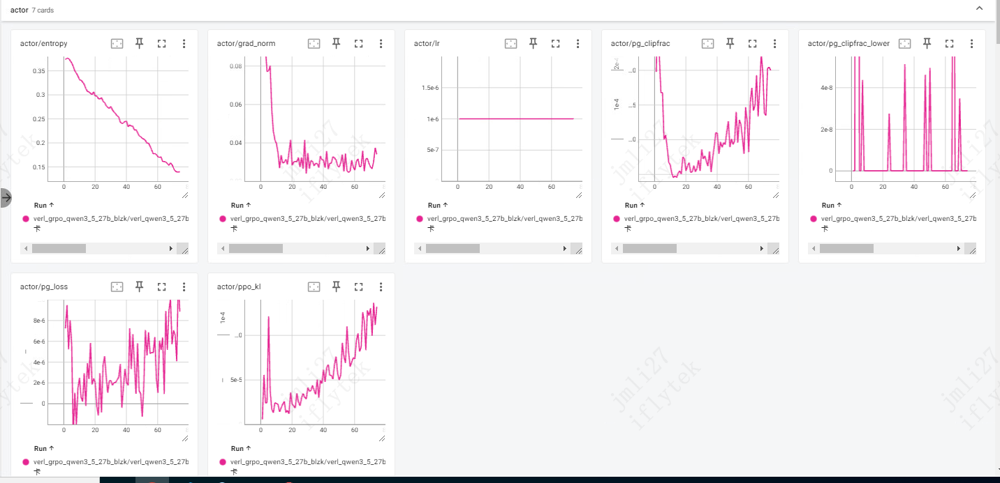

# Qwen3.5-27B Dense GRPO 实验结果

## 实验一：16 卡 actor 曲线分析




### 指标读数

| 指标 | 起始值 | 当前值 (step ~60) | 趋势 |
|---|---|---|---|
| **actor/entropy** | 0.37 | 0.13 | **单调下降，无平稳迹象** ⚠️ |
| actor/grad_norm | spike to 0.08 | 0.02-0.04 波动 | 早期 spike 后稳定 ✓ |
| actor/lr | 1e-6 | 1e-6 | 常数（无 lr schedule，符合预期）|
| actor/pg_clipfrac | 6e-4 → 0 → 上升 | 上升中 | clip 越来越频繁触发 ⚠️ |
| actor/pg_clipfrac_lower | 偶发 spike | ~0 | 低位 clip 极少 ✓ |
| actor/pg_loss | 0 ~ 8e-6 波动 | 波动 | 数值小、震荡正常（非 NaN）✓ |
| actor/ppo_kl | 0 | ~8e-5 上升中 | 当前策略离 rollout 时策略越来越远 ⚠️ |

### entropy 趋势分析

**结论：当前 entropy 下降速度偏快，正在接近 "entropy collapse" 的危险区，但还没崩。**

#### 健康 entropy 曲线 vs 你的曲线

| 阶段 | 健康范围 | 你的实际 |
|---|---|---|
| RL 初期 | 1.5 ~ 3.0（base model 通常这个量级） | **0.37**（已经偏低）|
| RL 中期 | 0.8 ~ 1.5（缓慢下降，凸函数曲线）| 0.13 step 60 |
| RL 后期 | 0.3 ~ 1.0（稳定平台）| **没有平台迹象，仍线性下降** |
| 危险 | < 0.1 = entropy collapse | 当前 0.13，**逼近危险区** |

#### 为什么起始值就只有 0.37？

base model（Qwen3.5-27B）经过 SFT 后通常 entropy 在 0.5-1.5。**0.37 已经偏低**，说明：
- base model 本身做这种"输出 JSON / 选项"的结构化任务时分布已经很尖
- 或者你的训练数据上模型本来就高自信（success rate 较高）

起点低 + 持续下降 = 越早警觉。

#### 三个相关指标互相印证

1. **entropy 一直降** → 模型分布越来越尖
2. **pg_clipfrac 上升** → 越来越多 sample 的 ratio 触发 clip → policy 单步移动幅度增大
3. **ppo_kl 上升** → π_new 离 π_old 越来越远 → 同上含义

**三者方向一致**，说明 actor 在**激进强化某些高概率 token**，分布逐渐 collapse 到少数 token 上。

### 为什么会这样：你当前配置的"激进性"

```bash
actor_rollout_ref.actor.use_kl_loss=False    # ← 关掉了对 ref 的 KL 约束
actor_rollout_ref.actor.entropy_coeff=0      # ← 没有 entropy 奖励
algorithm.use_kl_in_reward=False             # ← reward 里也没 KL 惩罚
```

**所有防 entropy collapse 的护栏都关了**，只剩 PPO clip + DAPO Dynamic Sampling 在挡。这是个**激进配置**，适合：
- 训练数据 reward signal 强、有明显学习方向
- 想快速看到 reward 提升

不适合：
- 想长期稳定训练（30+ epoch）
- entropy 起点本来就低的场景（你这个）

---

## 这种情况正常吗？

**短期可接受，长期有风险**。判断：

- ✅ **如果只训 1 epoch**（你目前 `total_epochs=1`，~100 step）：entropy 从 0.37 → 0.10 是可以接受的，期间 reward 应该已经涨到合理水平
- ⚠️ **如果想继续训 2+ epoch**：当前轨迹下，第 2 epoch 中后期 entropy 会跌破 0.05，**rollout 的 8 条 response 趋同 → group_std=0 → DAPO 大量过滤 → 有效训练样本骤减 → reward 增长停滞甚至倒退**

**最危险的信号**：当看到 `critic/rewards/mean` 先升后降 + `critic/advantages/std` 越来越小 + dapo manager 报告 filtered group 占比 > 50%，就是 entropy collapse 实锤了。

---

## verl 框架里防 entropy collapse 的 5 个工具

按"侵入性从弱到强"排序：

### ① 在 loss 里加 entropy bonus（最直接）

```bash
actor_rollout_ref.actor.entropy_coeff=0.001   # 0 → 0.001
```

数学上：
```
total_loss = pg_loss + kl_coef × kl_loss - entropy_coeff × entropy
                                          ↑
                          负号 = 鼓励 entropy 大（分布平）
```

**值的选择**：
- 0.001 ~ 0.005：温和，常见 RLHF 配置
- 0.01：较强（DAPO 论文用过）
- > 0.05：可能学不动

**实操**：你 entropy 已经偏低，建议直接加 `0.001`，**这是最简单的一招**。

### ② 开 KL loss（对齐 reference model）

```bash
actor_rollout_ref.actor.use_kl_loss=True       # False → True
actor_rollout_ref.actor.kl_loss_coef=0.01      # 你已经有这个值
actor_rollout_ref.actor.kl_loss_type=low_var_kl # 你已经有这个值
```

数学上：
```
total_loss = pg_loss + kl_loss_coef × KL(π_θ || π_ref) - entropy_coeff × entropy
```

**作用机制**：ref 是固定的 base/SFT model（entropy 较高），强制 π_θ 不能离 π_ref 太远 → 间接限制 entropy 下降速度。

GRPO 论文（DeepSeek-Math）和 DAPO 都建议开。**你现在 `use_kl_loss=False` 是相对激进的设置**。

详细见 [参数.md](../../参数.md) 的 "use_kl_loss True vs False" 章节。

### ③ DAPO Dynamic Sampling（你已经在用）

```bash
reward.reward_manager.name=dapo   # ← 已开
```

**机制**：rollout 完后，发现某 prompt 的 8 条 response 全 0 或全 1（group_std=0）→ **整组丢弃**，不参与训练。

**对 entropy collapse 的作用**：当 entropy 塌缩到 rollout 全一样时，dapo 会大量过滤 → 训练**自动减速**，给你时间发现问题。**这是兜底机制，不是治本药**。

### ④ DAPO Clip-Higher（非对称 clip）

```bash
actor_rollout_ref.actor.clip_ratio_low=0.2     # 经典 PPO 值
actor_rollout_ref.actor.clip_ratio_high=0.28   # 比 low 大,允许低概率 token 上探
```

**直觉**：经典 PPO clip 上下对称（±0.2），对**低概率 token 上升**和**高概率 token 下降**惩罚一样严。但 entropy collapse 的根因是"**高概率 token 越来越被强化**"，所以放宽**低概率 token 的探索空间**（clip_high 设大）能减缓 collapse。

DAPO 论文实测有效，是其四件套之一。你**还没开**。

### ⑤ 降低 lr / 增加 batch size（间接）

- `actor.optim.lr=1e-6` 已经偏小，**没空间往下**
- `ppo_mini_batch_size` 调大 → 每次更新梯度更稳 → entropy 下降更慢
  - 你现在 `ppo_mini_batch=128`, `train_batch=512`, 比值 4 次/step，**已经偏激进**
  - 改成 `ppo_mini_batch=256`, 比值 2 次/step，更稳

---

## 推荐改动（按优先级）

### 优先级 1：先加 entropy bonus（一行）

最容易、效果直接：

```bash
actor_rollout_ref.actor.entropy_coeff=0.001
```

**预期**：entropy 下降斜率明显趋缓，几个 epoch 后稳定在 0.15-0.25 平台。

### 优先级 2：打开 KL loss（一行）

```bash
actor_rollout_ref.actor.use_kl_loss=True   # 配套的 kl_loss_coef=0.01 你已经有
```

**预期**：观察 `actor/kl_loss` 指标，应该从 0 缓慢爬到 0.5-2.0 稳定。如果飙到 10+ 就太严，调小 `kl_loss_coef`。

### 优先级 3：加 Clip-Higher（DAPO 完整配置）

```bash
actor_rollout_ref.actor.clip_ratio_low=0.2
actor_rollout_ref.actor.clip_ratio_high=0.28
```

**预期**：`pg_clipfrac_lower` 会变成 0（低位完全不触发 clip），`pg_clipfrac` 高位触发频率略降。

### 优先级 4：调整 batch（更稳定）

```bash
actor_rollout_ref.actor.ppo_mini_batch_size=256   # 128 → 256, 每 step 更新次数 4 → 2
```

代价：rollout 数据效率降低（同一批数据训得更少）；收益：每次更新更稳，entropy 下降更慢。

---

## 当前实验的判断与下一步

**当前 1 epoch 训练（~100 step）下**：
- entropy 0.13 还能扛，**不需要中断**
- 继续观察 reward 是否在涨：如果在涨，让它跑完看最终结果
- **盯 `critic/rewards/mean` 和 `actor/entropy` 两条曲线**：
  - 如果 reward 还在涨 → 这次有收益，记下来作 baseline
  - 如果 reward 平了 / 倒退 + entropy 跌破 0.1 → 可以提前停

**下一次实验**（用什么改进版配置）：
建议直接上 **优先级 1 + 2**（entropy_coeff=0.001 + use_kl_loss=True），这是 GRPO 论文默认配置，**比你现在更稳但学习能力差别不大**。如果对比下来 reward 上升幅度差不多甚至更高，说明这两条护栏对你这个任务**几乎没成本，纯收益**。

---

## 面试金句（这次实验可以这样讲）

> 我用 GRPO 训 27B 时观察到 entropy 单调下降的趋势：从 0.37 跌到 0.13，**没有看到平台期**。结合 `pg_clipfrac` 上升 + `ppo_kl` 上升，判断模型正在向少数高概率 token collapse。
>
> 排查发现我的配置激进——**关掉了 KL loss 和 entropy bonus 两个护栏**，只剩 PPO clip 和 DAPO Dynamic Sampling 在兜底。下个实验我会：① 加 `entropy_coeff=0.001` 直接奖励 entropy；② 开 `use_kl_loss=True` 让 KL(π_θ‖π_ref) 拉住分布；③ 加 DAPO Clip-Higher 让低概率 token 有探索空间。**三招对 entropy collapse 是不同维度的防御**，一起开是 DeepSeek-Math / DAPO 论文的默认配置。

---

## 附：完整指标曲线截图位置

- 当前实验 actor 指标：[16卡actor.png](./16卡actor.png)
- 待补 critic 指标曲线：（待保存）
- 待补 reward / val 曲线：（待保存）
