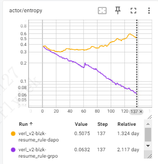
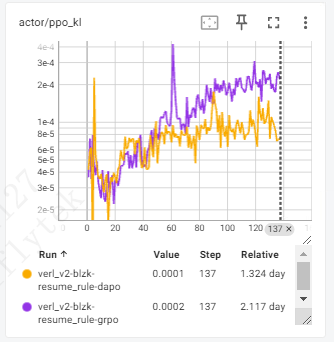
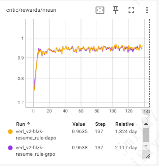
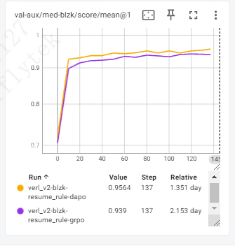
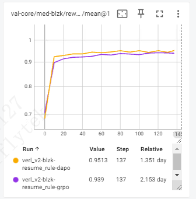
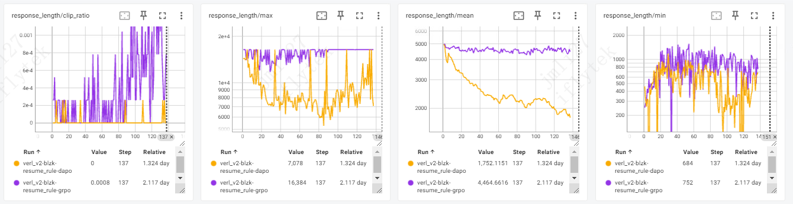

## 配置说明
模型：Qwen3.5-27B
数据集：blzk-20251127-fast:67478条，划分训练集 66101条，验证集 1377条
训练参数： batch_size=480 · rollout.n=8 · lr=1e-6，ppo_mini_batch_size=120
资源：GRPO = 32×H200，DAPO = 48×H200
步数：两者都跑到 step 137（1 epoch）

| 配置项 | GRPO 脚本 | DAPO 脚本 | 作用 |
|---|---|---|---|
| `clip_ratio_low / high` | 默认对称 0.2 / 0.2 | **0.2 / 0.28（Clip-Higher）** | 放宽对低概率 token 的「上调」裁剪 → **抑制熵塌缩、鼓励探索** |
| `clip_ratio_c` | 默认 | **10.0（dual-clip）** | 限制超大负优势的更新 |
| `filter_groups.enable` | 无 | 没开 | 丢掉「全对/全错」的 group，只留有梯度信号的难题 |
| `overlong_buffer_cfg` | 无 | **enable，buffer=8192，penalty=1.0** | 对超长回答线性扣分（response 上限 16384，最后 8192 是惩罚缓冲区）|
| `loss_agg_mode` | `token-mean`(默认) | `token-mean` | token 级 loss 聚合 |
| `kl_loss_coef` | 0.0 | 0.0 | 约束 actor 不要离 reference model 太远，**注意：两者 `use_kl_loss=False`，所以 KL loss 实际都没启用，这个系数都是摆设** |
| `use_kl_in_reward` | False | False | 两者都没有 KL reward 惩罚 |
| `entropy_coeff` | 0 | 0 | 两者都没有显式熵正则 |

## 训练结果：
### 熵对比：
DAPO 0.5075(熵维持甚至略升),GRPO 0.0632(严重熵塌缩)。
DAPO 全程保持探索,GRPO 训到后期基本变成确定性策略,失去探索能力。
直接对应配置:DAPO 的 clip_ratio_high=0.28(Clip-Higher)放宽了低概率 token 的"上调"裁剪,专门用来防熵塌缩;GRPO 对称 0.2/0.2 裁剪,熵一路掉到 0.06。

### actor/ppo_kl(单步策略更新幅度)
actor/ppo_kl 是「rollout 时的旧策略」与「正在更新的当前策略」之间的 KL，不是相对 reference model 的 KL
old_log_prob = 生成 rollout 时那个策略（behavior/旧策略）算出的 log prob；
log_prob = 当前正在更新的策略的 log prob；
ppo_kl = mean(old_log_prob − log_prob) ≈ KL(旧策略‖当前策略) 的一阶近似。
所以它衡量的是 PPO 更新让策略偏离"采样时的策略"有多远（和那个 clip 的重要性比 ratio 是同源的），是更新前后/行为-当前的 KL。
actor/ppo_kl 是「rollout 时的旧策略」与「正在更新的当前策略」之间的 KL，不是相对 reference model 的 KL
ppo_kl = on-policy 程度的度量（旧策略 vs 新策略），不是 ref KL。 它变大意味着更新步子迈大了（可能 off-policy、需警惕），而不是"偏离参考模型"。
reference KL（actor/kl_loss / reward 里的 KL 惩罚）：当前策略 ↔ 冻结的 reference model，use_kl_loss / use_kl_in_reward 开启时才有，比较对象是 ref policy
在137 step，DAPO ： 0.0001,GRPO ： 0.0002,
每次 PPO 更新前后策略的 KL：两者都随训练缓慢上升,GRPO 整体更高、毛刺更多 ，DAPO更新更温和

## 训练 reward
在第137 step，DAPO 和 GRPO 分别为 0.9635 和 0.9638 ，基本持平，DAPO 没有因为熵高而崩 
在 trainer 里（ray_trainer.py:1591/1603）：
batch.batch["token_level_scores"]  = reward_tensor                 # reward manager 的输出(已含 overlong 惩罚)
batch.batch["token_level_rewards"] = batch.batch["token_level_scores"]  # use_kl_in_reward=False 时直接相等
                                     # (+ KL 惩罚，仅当 use_kl_in_reward=True)

（ use_kl_in_reward=False → token_level_rewards == token_level_scores → critic/score == critic/rewards，而且两者都是"含长度惩罚的 reward"（不是原始分）。所以训练里它俩一样。）

## val 两条曲线(score vs reward)
- DAPO 在验证集泛化上领先 GRPO 约 1.7 个点(0.9564 vs 0.939)。
- DAPO 内部 score(0.9564)> reward(0.9513),这 0.005 的差就是 overlong_buffer(8192 缓冲区、penalty=1.0)对超长回答的线性扣分;GRPO 没开 shaping,score=reward。

[text](分析.md)  

## response_length
平均回答长度：
DAPO 从 ~5000 一路压到 1752,GRPO 稳在 4464。
对应 DAPO 的 overlong_buffer(上限16384、最后8192惩罚)，持续把长度往下压。
结论:DAPO 学会了用 1/3 的长度答对更多题(配合 score 更高),是明显的效率/简洁性收益,没有牺牲正确率
GRPO截断比例较高，到第137 step，仍有截断

## 出厂验收集效果
测试验收集
qwen27b baseline 慢思考 F1 0.874
rl后：（难度过滤后的数据）
精确率：90.22%
召回率：88.33%
F1：89.27%
