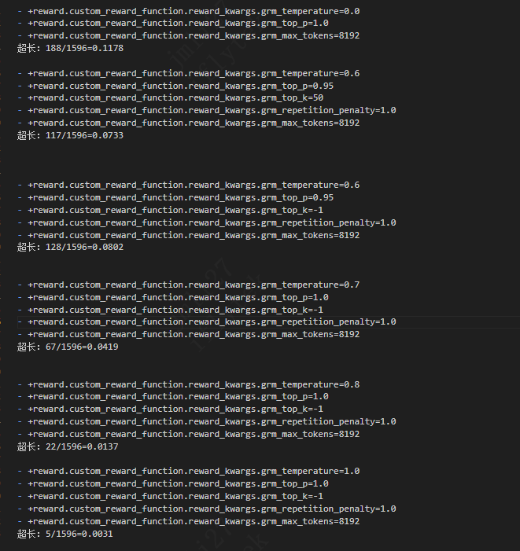

# GenRM 裁判超长截断调参

**目标**：降低 med-exam GenRM 裁判因复读导致的超长截断（`finish_reason=length`，思考没写完就被 `max_tokens` 截断，JSON 解析失败 → `genrm_failed=1` 软丢弃）。

**统一口径**：1596 条 med-exam 验证样本，走 server 路径（与实际 RL 训练同一条调用链），`max_tokens=8192`，统计超长截断条数 / 比例。

---

## 实验一：温度 / top_p / top_k 扫描（不加惩罚）

来源：下方 `med-exam27B超长.png`（`repetition_penalty=1.0`，即不加任何惩罚）。

| temperature | top_p | top_k | 超长 | 比例 |
|---|---|---|---|---|
| 0.0 | 1.0 | -1 | 188/1596 | 11.78% |
| 0.6 | 0.95 | 50 | 117/1596 | 7.33% |
| 0.6 | 0.95 | -1 | 128/1596 | 8.02% |
| 0.7 | 1.0 | -1 | 67/1596 | 4.19% |
| 0.8 | 1.0 | -1 | 22/1596 | 1.37% |
| 1.0 | 1.0 | -1 | 5/1596 | **0.31%** |

**结论**：温度是超长截断的主导因素，**温度越高复读越少、超长越少**。贪心解码（temp=0）最差（11.78%），temp=1.0 仅 0.31%。在 temp=0.6 下收紧 top_p=0.95 / top_k（50 或 -1）并无明显帮助。

---

## 实验二：固定 temp=0.7，惩罚参数扫描

固定 `temp=0.7, top_p=1.0, top_k=-1`，逐个叠加防复读惩罚。

| 配置 | 超长 | 比例 | 备注 |
|---|---|---|---|
| presence_penalty=0（基线） | 71/1596 | 4.4% | |
| presence_penalty=1.2 | 20/1596 | 1.25% | |
| presence_penalty=1.5 | 16/1596 | 1.0% | |
| presence_penalty=1.5 + frequency_penalty=0.2 | 587/1596 | 36% | ❌ 暴涨，且输出乱码、自然表达受损 |
| presence_penalty=1.5 + repetion_penalty=1.05 | 16/1596 | 1.0% | |
| presence_penalty=1.5 + repetion_penalty=1.1 | 14/1596 | **0.9%** | 本组最优 |

**结论**：
- `presence_penalty` 最有效，0→1.5 把超长从 4.4% 压到 1.0%；1.2→1.5 收益已趋平（边际拐点）。
- `repetition_penalty=1.1` 可轻微叠加（16→14）。
- `frequency_penalty` **有害**：扣分随出现次数累加，惩罚了 JSON 高频标点，导致乱码 + 超长暴涨至 36%，务必保持 0。

---

## 实验三：低温 + 收紧采样 + 惩罚（组合）

| 配置 | 超长 | 比例 |
|---|---|---|
| temp=0.6 + top_p=0.95 + top_k=20 + presence_penalty=1.5 + repetion_penalty=1.1 | 46/1596 | 2.9% |

**结论**：把温度降到 0.6 并收紧 top_p/top_k，即便叠加惩罚，超长反而回升到 2.9%——比"temp=0.7 + 惩罚"（0.9%）和"纯 temp=1.0"（0.31%）都差。**再次印证温度才是主导，不应降温。**

---

## 其它

- 当前 sglang 版本**不支持** Qwen3.5 的 thinking budget（`Qwen35ThinkingBudgetLogitProcessor` 导入失败），该路线走不通，已从调参脚本中移除。

---

## 综合结论 & 推荐

1. **温度是第一杠杆**：高温显著降低复读型超长，低温（尤其贪心）最糟。
2. **`presence_penalty` 是最有效的惩罚项**（Qwen3 官方推荐抗重复手段，范围 0~2），`repetition_penalty` 可作轻微兜底。
3. **`frequency_penalty` 不能用**——伤 JSON 标点、出乱码、超长暴涨。

**当前落地配置**（已写入 `reward_fn_medexam_genrm_remote.py` 与 `my-run_qwen3_5-27b-megatron-dapo-multi.sh`）：
`temp=0.8 + top_p=1.0 + top_k=-1 + presence_penalty=1.5 + repetition_penalty=1.1`，兼顾低超长与判分稳定。

> ⚠️ 注意：实验只衡量了"超长截断率"。纯高温（temp=1.0，0.31%）截断最少，但温度过高可能影响裁判打分的一致性/JSON 稳定性，故训练默认用 temp=0.8 + 惩罚而非一味拉高温度。如需进一步压低截断，可单独验证 temp=1.0 下的判分质量后再决定。

## 实验4：blsc不同温度的判分一致率与解码重复率（blsc 任务）

 **blsc 病历审查**（无 GT、要逐字段真推理）来测：直接拿 blsc 数据里的 (医患对话, 参考病历) 当被审样本，固定其余采样、**只改温度、同参数跑 N=5 次**，看 N 次审核结论是否一致。

**配置**：blsc，1222 样本，N=5，`top_p=0.95 / top_k=20 / min_p=0 / presence_penalty=1.5 / repetition_penalty=1.0`，**max_new_tokens=16384**。（离线 sgl.Engine）。

| temp | label一致率 | score一致率 | 平均Jaccard | score_std | parse失败 | 超长截断率 | 生成tokens均值 |
|---|---|---|---|---|---|---|---|
| 1.0 | 0.5704 | 0.5982 | 0.7697 | 0.1908 | 2.06% | 0%  | 7383 |
| 0.9 | 0.5679 | 0.5949 | 0.7629 | 0.1912 | 1.98% | 0%  | 7349 |
| 0.8 | 0.5646 | 0.5998 | 0.7644 | 0.1941 | 2.27% | 0%  | 7358 |
| 0.7 | 0.5998 | 0.6252 | 0.7787 | 0.1770 | 2.00% | 0.02%  | 7309 |
| 0.6 | **0.6121** | **0.6498** | **0.7889** | **0.1676** | 1.87% | 0.07%  | 7270 |

> 指标含义：`label一致率`=5 次审核标签集**完全一致**的样本占比；`score一致率`=5 次三档分（1.0/0.5/0.0）完全一致占比（最贴近 reward 稳定性）；`Jaccard`=5 次标签集平均两两交并比；`score_std`=每条样本 5 次分数标准差的均值（越低越稳）；

**结论**：
1. **温度越低，判分越一致**：1.0→0.6 时 score一致率 0.60→0.65、label一致率 0.57→0.61、Jaccard 0.77→0.79、score_std 0.19→0.17。拐点在 0.7：**0.6/0.7 明显比 0.8~1.0 稳**（0.8 反而是一致性谷底）。低温=采样更确定=判分更稳，符合直觉。
2. **温度越低，复读率越高**：与截断实验"高温降复读"一致。
3. **blsc 几乎不超长**：max_tokens 给到 16384 后全程 ~0%，本实验里截断不是区分项。
4. **张力**：高温降复读 ↔ 低温升一致性，方向相反，但两边幅度都不大（各 ~4–5 个点）。parse 失败稳定 ~2%。

### 关键洞察：复读率"反直觉"——为什么更难的 blsc 复读反而比更简单的 med-exam 低？

复读的根因**不是任务难易，而是"有没有实质内容可写"**：

- **med-exam（简单却复读高）**：GT 已在 prompt 里，判分本质是确定性比对，没多少可推理的；但 thinking 模式**强制**输出长 `<think>`。没东西可说 → 用重复内容填充 → 退化成循环 → 复读 + 截断。**"简单任务 + 强制长思考 = 没话说 = 复读"**。
- **blsc（难却复读低）**：逐字段审核（主诉/现病史/既往史/诊断/诊疗意见…）有大量真实结构化内容，模型总有"下一个字段"要分析 → 持续产出新内容 → 不易陷入死循环。**"内容丰富 = 一直有话说 = 少复读"**。

推论：blsc 的 rep10≈0.3 多半是审核用语跨字段的**合法重复**（如"与对话一致""符合要求"），不是病态循环，所以截断 ~0；med-exam 的复读是**病态失控**→ 截断。**直接比两任务的 rep10 是苹果比橘子**；真正的失败信号是"会不会失控截断"——blsc 不会、med-exam 会。这也解释了为什么 blsc 即便 max_tokens 翻倍到 16384 仍几乎不截断。

### 对训练温度选择的影响

一个共享 GenRM 同时服务两任务，但两任务的最优温度方向相反：
- med-exam：**截断**对高温敏感（高温收益大，见实验一/二）；
- blsc：**一致性**对低温敏感（低温收益小，~4–5 点），且不截断。

- **选项 A（推荐）**：两任务用**不同温度**。奖励函数已分离（`compute_score_medexam_*` / `compute_score_blsc_*`），可加 task 级配置（如 `GRM_TEMPERATURE_BLSC`）让 blsc 走 0.6~0.7、med-exam 走 0.8~1.0，各取所需。
- **选项 B**：折中单温度 **0.8**（当前默认）。blsc 一致性损失 ~4–5 点、med-exam 截断可控。

> ⚠️ 更值得注意的是：blsc 即便在最优温度(0.6)，仍有 **~35% 样本的 5 次判分会翻车**（label 一致率仅 0.61、score 一致率 0.65）——这是不小的 **reward 噪声**。靠调温度只能改善几个点。要实质降噪，更直接的办法是**judge 多次采样聚合**（同一样本采 k 次，取多数标签 / 平均分作为最终 reward），比调温度更能压住方差。这是比"挑温度"优先级更高的改进方向。